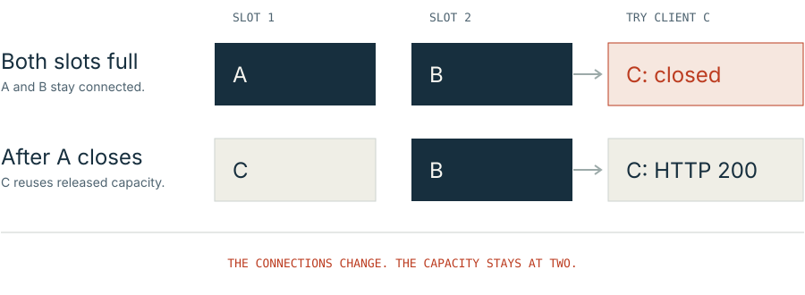

# Two slots. Three clients.

See Baz's connection limit for yourself. Open two connections, try a third,
then release a slot and try again. You control each step from your terminal.

**Allow about five minutes.** You need two terminals, exact Zig 0.16.0, Python 3,
and a checkout of Baz. The client uses Python's standard library; there are no
Python packages to install. The website is your guide; the server and clients
run locally on your machine.

<div class="image-scroll" tabindex="0" aria-label="Scrollable diagram of two connection slots">

</div>

## 1. Start Baz with two slots

If you do not have the repository yet:

```sh
git clone https://github.com/technologylab-ai/baz.git
cd baz
```

If you already have a checkout, open it in your terminal and run `git pull --ff-only`
to get this walkthrough. Check `zig version`: it must print `0.16.0`.

In **terminal 1**, from the Baz directory, run:

```sh
zig build run-app -Doptimize=ReleaseSafe -- --port 8080 --connections 2 --shards 1 --timeout-ms 300000
```

Wait for a line beginning `READY port=8080`. Leave this terminal running.
The first build may take longer while Zig fetches dependencies and compiles.

| Option | Why we use it |
| --- | --- |
| `--connections 2` | Reserve two admitted connection slots. |
| `--shards 1` | Use one I/O owner for this small exercise. |
| `--timeout-ms 300000` | Give yourself five minutes between actions before idle connections expire. This is a walkthrough setting, not a deployment recommendation. |
| `-Doptimize=ReleaseSafe` | Keep runtime safety checks enabled. This exercise measures no performance. |

Use only the walkthrough client against this port during the exercise. Browser
tabs can open their own connections, which would also count toward the two slots.

## 2. Open the interactive client

In **terminal 2**, also from the Baz directory, run:

```sh
python3 examples/connection_limit.py
```

On Windows, use `py -3 examples/connection_limit.py` if that is how you launch
Python. The Zig server command is the same in PowerShell. Keep terminal 1 open.

The client pauses before each action. **Press Enter once, read the result, then
continue when you are ready.** Ctrl-C exits and closes the client's connections.
The [complete client source](../examples/connection_limit.py) is available in
this reader if you want to follow the HTTP calls.

## 3. Fill both slots

At the first prompt, press Enter to open connection **A**. It requests
`/hello?name=client-A`, reads the response, and keeps its connection open:

```text
A: HTTP 200 - client-A; held open.
Held by this walkthrough: A (1 of 2 slots).
```

At the next prompt, press Enter to open **B**:

```text
B: HTTP 200 - client-B; held open.
Held by this walkthrough: A, B (2 of 2 slots).
```

Both handlers have finished. Both response bodies have been read. Yet both
connection slots remain occupied: an idle HTTP/1.1 keep-alive connection still
counts. There is no slow handler or streaming response involved here.

The `HTTP 200` acknowledgments matter. A successful TCP connection alone does
not prove that Baz admitted a socket into one of its slots.

## 4. Try the third connection

Press Enter at the third prompt to try **C**, while A and B remain connected:

```text
C: closed by the server without an HTTP response.
A and B still answer on their original connections. Both slots remain occupied.
```

This is the limit in action. The [bounded/http](https://technologylab-ai.github.io/bounded-http/)
engine closes the extra accepted socket. It does not allocate another connection
slot or promise an HTTP `503` response. The client reports a close/reset in plain
language, and checks that A and B still work on their original sockets.

C does not wait in a Baz application queue for someone else to leave. Its
connection is closed. It will need a new attempt after capacity becomes available.
A network timeout is not counted as a successful demonstration of refusal.

## 5. Release a slot and retry

At the fourth prompt, press Enter to close **A**:

```text
A: closed. Baz can reclaim its slot after connection cleanup.
Held by this walkthrough: B (1 of 2 slots).
```

At the fifth prompt, press Enter to try **C** again:

```text
C: HTTP 200 - client-C; admitted after A released a slot.
B still answers on its original connection.
```

The client briefly retries if the server is still completing cleanup of A.
It allows up to two seconds for recovery. B remains connected throughout.
The client then closes B and C and exits.

You have observed all three states:

| State | Connections retained | Result of trying C |
| --- | --- | --- |
| Both slots occupied | A and B | Refused: the server closes C. |
| A has closed | B, with A's cleanup completing | Capacity can become reusable. |
| A's slot is reusable | B and newly admitted C | C receives HTTP 200. |

In terminal 1, press **Ctrl-C** to stop Baz. Its final `STATS` line should show
`peak_connections` equal to `2`, `rejected` at least `1`, and `live_connections`
equal to `0`. Recovery retries can increase the rejection count. These are
server counters; the client's earlier “held” lines describe only its own sockets.

## What you learned

The connection limit counts retained connections, including idle ones. It is
different from the worker count, the number of active handlers, and the total
number of requests served over time. One connection can serve many requests.

This exercise demonstrates **admission refusal and recovery**. Backpressure
within an admitted connection is a separate mechanism: a producer waits when
output cannot drain. Read [limits and backpressure](LIMITS.md) for that connection,
or [pipelining and browser downloads](PIPELINING.md) for multiple requests on a
connection.

## If your result differs

| What you see | What to check |
| --- | --- |
| The server cannot bind port 8080 | Choose another unused port, for example `--port 8082`, in terminal 1. Pass `--port 8082` to the Python client too. |
| Python cannot connect | Wait for `READY` and check that both commands use the same port. |
| A or B is refused | Another client may already occupy a slot. Close clients using this server, then restart the walkthrough. |
| A held connection closes, or C unexpectedly succeeds | You may have paused past the five-minute deadline, used the default shorter timeout, or started with a different connection limit. Check the server command and restart the client. |
| The client reports a timeout | This is an inconclusive result, not the expected refusal. Check that Baz is still responsive and that you used the documented local setup. |
| The client exits after Ctrl-C or the terminal closes | Its sockets close too. Start it again to repeat the exercise; stop Baz separately in terminal 1. |

The walkthrough is a user-run exercise. The separate
[App wire test](../tests/app_integration.py) provides automated regression
coverage for overload and slot recovery.
