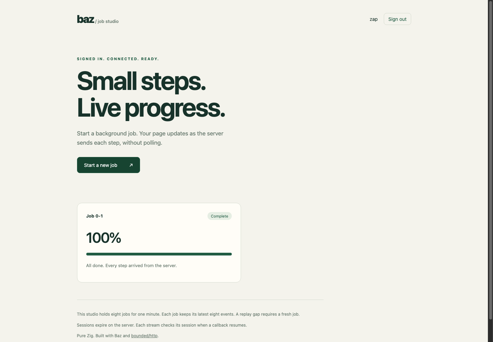

# A complete live-job application

Run a small application that combines Baz's Mustache templates, cookie sessions,
and notification-driven server-sent events:

```sh
zig build run-jobs -Doptimize=ReleaseSafe -- --port 8080 --execution workers --workers 1
```

Open `http://localhost:8080`. Sign in as **zap / awesome** or **baz / awesome**,
start a job, and watch its progress arrive through the browser's `EventSource`.
These are public demo credentials for two separate identities. The application
also runs with inline callbacks. Its background producer is a separate startup
thread; waiting HTTP streams retain bounded state and release the callback executor.
Worker execution currently uses one HTTP shard. Linux and Windows also support
multiple shards with inline callbacks; macOS uses one shard.

The [server source](../examples/jobs.zig) keeps routing, auth and stream policy
together. [Job storage](../examples/endpoint/job_store.zig) and
[session storage](../examples/endpoint/session_store.zig) are example-local
services. [Page markup](../examples/assets/jobs.html),
[login markup](../examples/assets/jobs-login.html),
[styles](../examples/assets/jobs.css) and [browser code](../examples/assets/jobs.js)
live in separate files. Mustache parses the page once at startup; each render
uses typed data and reserved response storage.

## Rendered example



Captured from the running ReleaseSafe application in Chrome 152. The browser
gate also exercises 390 px and 320 px layouts, sign-in/out, all eleven events,
and native reconnect with `Last-Event-ID` after the fixed request deadline.
To see a reconnect yourself, add `--tick-ms 1200` to the startup command: the
job then outlasts one ten-second response and resumes on a new connection.

## Deliberate limits

| Resource | Example policy |
| --- | --- |
| Jobs | Eight fixed slots, including completed jobs. No live eviction; full returns 503. |
| Job lifetime | Absolute 60 seconds by default; `--job-ttl-ms` is a positive u32. |
| Replay | Eight events per job. No disk persistence or unbounded history. |
| Progress | Initial 0, then increments of 10 to 100; default producer tick 250 ms. `--tick-ms` is positive. |
| Sessions | 32 reusable slots, absolute 30-minute server expiry by default; `--session-ttl-ms` is positive. Browser cookie is a session cookie. |
| Waiting streams | 32 continuation and subscriber slots. Additional streams receive 503; ordinary routes use no continuation slots. |
| Connections | 64 by default, independently configurable with `--connections`. |
| Response staging | 8192 bytes per callback; cumulative response size has a separate 64 KiB limit. |
| Request lifetime | Fixed 10-second deadline, unchanged by events or heartbeats. Shutdown drain is bounded to one second. |
| Producer | One startup thread with an explicit 512 KiB stack; no thread per job or client. |

The application-owned store, subscription array, producer stack and template
storage are outside the framework allocator's ledger. They have explicit fixed
capacities. The shared application guard is a single try-lock: request admission
may return 503 under contention. A resumed stream retries with a 10 ms timer
instead of blocking its callback executor. The producer also retries boundedly.

## Streaming and reconnect policy

`POST /jobs` returns 201 with `{"id":"slot-generation"}`. Generations never wrap,
so an expired job ID cannot name a reused job slot. `GET /jobs/:id/events`
requires the current session and that job's owner. Other users and expired IDs
both receive 404. IDs are examples of explicit parsing, not framework coercion.

Events have canonical decimal sequence IDs, a `progress` or `done` name, and
JSON data such as `{"progress":40,"done":false}`. The SSE encoder supplies the
wire format; the application supplies those JSON bytes. The producer publishes
progress under the application guard and signals after releasing it. Signals
coalesce: the callback reads the replay ring until caught up, one event per flush.
The producer signals subscribers each tick, including when no job advances,
so authorization and expiry checks still run. A one-second notification timeout
provides comment heartbeats between producer signals when ticks are longer.

The example UI permits up to three automatic reconnect attempts per stream,
then closes it and asks for a new job. Browser reconnects send `Last-Event-ID`; the server accepts one canonical decimal
value, rejects duplicate/malformed/future cursors with 400, and replays retained
events after it. A missing cursor means zero. If history was lost before headers
were published, it returns 409. If a live subscriber falls behind the ring, it
sends the latest snapshot as `reset` and finishes. The browser stops that stream
and explains that a new job is needed. Reconnecting after an acknowledged final
event returns 204, which stops automatic EventSource retries. HEAD does not
register a subscriber.

`retry: 1000` is a browser reconnect hint; it does not make delivery durable or
exactly once. Event IDs belong to one job generation. Reloading the page does
not restore jobs from durable storage. The server's fixed request deadline can
force a reconnect, and completed history expires at the original job deadline.

## Authentication and lifetime

Middleware authenticates initial admission. Every resumed stream callback checks
the original session token again against server-side expiry and revocation.
An expired/revoked token ends a published stream with `session-expired`;
a missing/expired job ends it with `expired`. A logout revokes the presented
session, not every session for that identity. It does not cancel the background
job; other valid sessions for the owner may still read retained progress.
Explicit cross-origin browser POSTs are rejected through Fetch Metadata.

Authorization is checked before constructing each snapshot. Bytes already
published or admitted before revocation may still arrive. No API can retract
those bytes from the network. This local demonstration supplies neither JWT nor
a production identity service.

Subscriber cleanup uses an atomic release on all terminal paths. Generation-safe
notification handles can become stale between producer publication and signalling.
That is an ordinary result. Startup teardown stops and joins the producer before
`App.deinit` releases its notification cells; no producer retains Context or writer
pointers. Request deadlines, disconnects and shutdown release continuation state
only after the engine reconciles its outstanding borrows.

## Verification scope

`zig build verify` includes job/replay bounds, expiry, generation retirement,
owner isolation and public example compilation. `tests/jobs_integration.py`
exercises the complete HTTP workflow with inline callbacks and one worker,
including reconnects, auth, capacity, delayed readers, disconnect and shutdown.
The eleven small progress events can fit in kernel socket buffers: delayed-reader
coverage here does **not** prove transport saturation. The maintained streaming
wire suite covers transport backpressure separately. No performance result is
claimed for this demonstration. See the [qualification receipt](../reports/2026-09-07-notifications.md)
for current native platforms, source identity and browser evidence.
