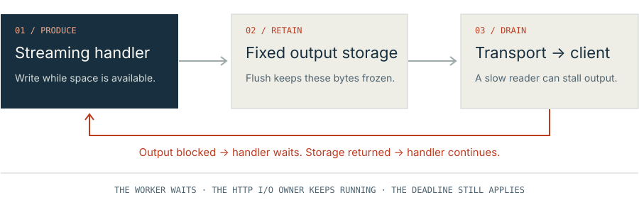

# Limits and backpressure

A limit says how much work or data Baz can hold. Backpressure makes an earlier
stage wait when the next stage cannot make progress. Rejection refuses work
that cannot be admitted. Baz needs all three: a connection ceiling alone cannot
stop one fast handler from filling its output buffer behind one slow client.

**Try it yourself:** [Two slots. Three clients.](CONNECTION-LIMIT-WALKTHROUGH.md)
walks you through filling the connection limit, observing refusal, and releasing
capacity. You control each step in your terminal.

Baz configures the [bounded/http](https://technologylab-ai.github.io/bounded-http/)
engine through [`App.init`](https://technologylab-ai.github.io/baz/api/#baz.App.AppWithLocals.init)'s `server` options, and adds response and continuation
limits of its own. Storage and workers are reserved before request processing.
The settings below describe the [pinned dependency](../build.zig.zon); examples
can override the defaults.

## Connections, requests, and workers

A connection is one admitted TCP connection. It occupies a connection slot even
while idle, receiving input, waiting for application work, or sending output.
One HTTP/1.1 connection can carry many requests over time. Pipelining lets a
client send later requests before earlier responses arrive.

The engine keeps one active application request per connection. It can retain
several finished responses for an ordered send batch. That is different from
running several handlers simultaneously on the same connection.

Inline callbacks run on their connection's I/O owner and must be short and
nonblocking. Several connections can have network operations in flight while
that owner invokes callbacks one at a time. With fixed workers, the worker count
bounds simultaneously executing callbacks; other admitted requests wait in
bounded state. A blocked callback delays other connections assigned to its worker.

| Setting | Default | What it bounds |
| --- | --- | --- |
| `server.connections` | 128 | Admitted connections across the entire cluster, including idle keep-alive connections. It is neither a user count nor a requests-per-second target. |
| `server.workers` | 0 | Application worker threads. The default execution mode is inline; worker execution requires a positive count and one shard. |
| `server.output_bytes` | 64 KiB | Output arena per connection, including response heads, framing, and staged output. |
| `response.body_bytes` | 8 KiB | Copied/generated one-shot body, or staging space for each streaming chunk or continuation snapshot. |
| `server.max_response_bytes` | 16 MiB | Total logical body of a response, including all streaming writes or a borrowed body. |
| `server.response_batch_limit` | 128 inline; effectively 1 with workers | Finished responses retained per connection before a drain. Available arena space can force an earlier drain. This is not a client pipeline-depth limit. |
| `max_continuations` | 0 | Concurrent retained continuation states. Routes using continuations must opt into storage. Ordinary routes consume no continuation slots. |
| `server.timeout_ms` | 5000 ms | Request-cycle deadline, including input, execution waits, and output. Streaming flushes and continuation waits do not reset it. |

Request header/body bounds and `server.memory_budget_bytes` are separate checks.
Startup rejects inconsistent or over-budget configurations. Each shard reserves
the full configured connection storage, while admission stays cluster-wide:
adding shards can increase reserved memory without raising the connection ceiling.
The budget covers requested framework storage and startup stacks; application
allocations, kernel socket buffers, and allocator metadata need separate accounting.
See the engine's [resource boundaries](https://technologylab-ai.github.io/bounded-http/docs/read.html?file=docs/ARCHITECTURE.md#resource-boundaries)
and Baz's [ownership contract](OWNERSHIP.md#execution-and-resources).

## One slow reader is enough

Suppose a handler could generate 1 MiB each second while its client reads only
100 KiB each second. The connection count could be just one. Output would still
accumulate if the producer never waited.

With the linear [streaming API](STREAMING.md#writer-and-lifecycle):

1. The handler copies bytes into fixed staging storage.
2. A full staging buffer automatically flushes before accepting more bytes.
   An explicit `flush()` can send a partially filled buffer.
3. The worker waits while the I/O owner sends the frozen output. If local socket
   buffering can accept it promptly, the wait can be short. A slow reader
   eventually prevents further progress once that buffering fills too.
4. Local transmission completion returns the output storage to the handler,
   which can continue producing bytes.

The I/O owner continues servicing network events during the worker's wait.
The wait retains that worker, request input, and connection slot. A successful
flush means the local transport has released its borrow; it does not prove that
the peer received or processed the bytes. Deadlines, disconnects, and shutdown
can cancel the wait. Storage stays retained until application and kernel borrows
have both returned.

[Typed continuations](CONTINUATIONS.md#explicit-steps) express the same dependency
by returning `.flush` and resuming on `.flushed`. They release the executor while
waiting, but retain bounded request state and a connection slot. Their snapshot
writer does not automatically send when full: split output across callbacks;
a write that exceeds the snapshot capacity reports `ResponseLimit`.

## What happens when a bound is reached

| Boundary | Current behavior | What permits progress again |
| --- | --- | --- |
| Connection admission is full | An extra accepted socket is closed without allocating another request slot. A 503 response is not guaranteed. The kernel's connection backlog is outside this ceiling. | An existing connection releases its application and transport owners. |
| Older pipelined output leaves too little room for a one-shot response draft | The engine drains older output before dispatching the next handler. Application side effects are not replayed. | Enough output space becomes reusable. |
| Linear streaming staging is full | Flush the output and wait on the same worker. | Local transmission completes, or cancellation returns an error. |
| A worker is occupied | Other requests assigned to it wait in bounded connection state; the engine creates no extra worker. | The callback returns; a continuation can release the worker between steps. |
| Continuation slots are occupied or contended | Baz returns 503 before application middleware runs. | A later request can acquire an available slot. |
| A request or response exceeds its size bound | Parsing or response construction fails. Waiting cannot make an oversized message fit its total bound. | The application/client must use a representation within the configured bound. |
| A request deadline expires | The engine cancels/closes and reconciles outstanding owners. A partially sent response cannot be replaced with a new error response. | Cleanup releases the resources; arbitrary application code must cooperate. |

Backpressure absorbs a temporary mismatch between stages using bounded waiting.
It does not add processing capacity or guarantee eventual success under sustained
overload. Size limits, admission refusal, and deadlines remain necessary.

## HTML and several images

A browser fetching a page and four images does not require five active handlers
on one HTTP/1.1 connection. Browsers normally use a pool of HTTP/1.1 connections
for parallel downloads and reuse those connections over time. Chromium's
[pipelining status](https://www.chromium.org/developers/design-documents/network-stack/http-pipelining/#status)
records removal of its pipelining option.

Baz accepts pipelined HTTP/1.1 requests and returns their responses in order.
HTTP/1.1 requires that response ordering even if a server chooses to compute
safe requests in parallel. A slow first response holds up later responses on
the same connection. HTTP/2 uses independent streams to interleave responses;
the current engine serves HTTP/1.1 and has no HTTP/2 or HTTP/3 transport.
See [RFC 9112 §9.3.2](https://www.rfc-editor.org/rfc/rfc9112.html#section-9.3.2)
and [RFC 9113 §5](https://www.rfc-editor.org/rfc/rfc9113.html#section-5).

The [pipelining assessment](PIPELINING.md) separates current implementation
limits, existing correctness evidence, and the measurements needed before
changing the scheduler or introducing another concurrency setting.

## Further reading

- [Streaming: worker occupancy and cancellation](STREAMING.md#workers-sleep-and-cancellation).
- [Continuations: retained state and admission](CONTINUATIONS.md#retained-state-and-cleanup).
- [Engine architecture: output reservation before dispatch](https://technologylab-ai.github.io/bounded-http/docs/read.html?file=docs/ARCHITECTURE.md#output-layout-and-copies).
- [Engine source at the pinned revision](https://github.com/technologylab-ai/bounded-http/blob/886b728bec79c36ca1ec69345b609a725617a9ea/src/server.zig), [Baz startup options](../src/App.zig), and [response limits](../src/response.zig).
