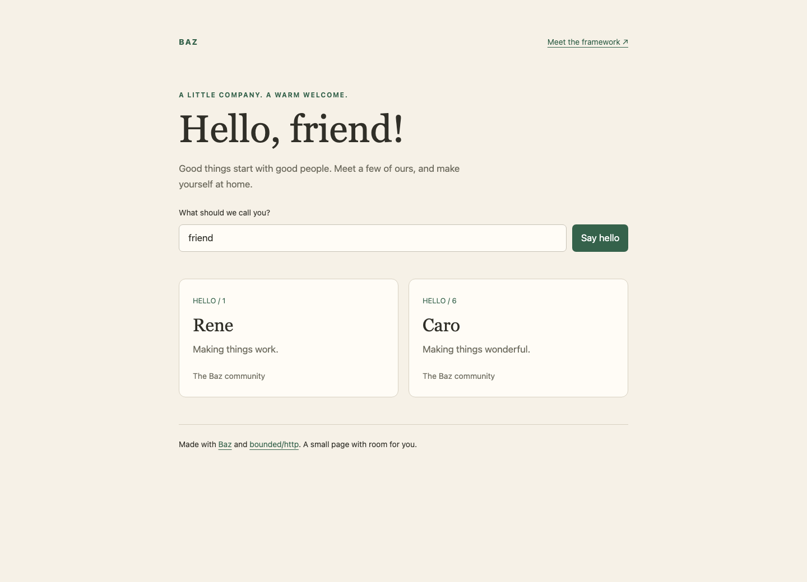

# Mustache templates

Baz renders Mustache with a [pure Zig, MIT-licensed library](https://github.com/technologylab-ai/mustache-zig),
ported to exact Zig 0.16.0 and extended with explicit rendering limits.
Parse templates once at startup. Pass ordinary typed Zig data to a handler;
render directly into its reserved response storage.

## Rendered example



This is a preview of the rendered page. Run the [complete example](../examples/mustache.zig)
locally to use the greeting form:

```sh
zig build run-mustache -Doptimize=ReleaseSafe -- --port 8080
# Open http://127.0.0.1:8080/ in your browser.
```

It serves a greeting form and user cards. The [page template](../examples/assets/mustache.html)
and [user partial](../examples/assets/mustache-user.html) keep HTML/CSS separate
from the 52-line Zig program. Query values remain raw until the handler explicitly
decodes and validates the name into a fixed stack buffer.

## Parse once, render typed data

Keep a `web.mustache.Template` in your App's `Shared` state. Initialize it before
starting the App, and deinitialize it after the App has stopped:

```zig
var template = try web.mustache.Template.init(init.gpa, @embedFile("page.html"), .{
    .partials = &.{.{ .name = "user", .source = @embedFile("user.html") }},
});
defer template.deinit();
```

Each named partial is parsed separately, starting with the usual `{{` and `}}`
delimiters. There is no implicit filesystem lookup. Use `@embedFile`, or read
files explicitly during startup and pass their contents to `init`.

A handler can render borrowed typed values directly:

```zig
fn hello(ctx: *Application.Context) !void {
    return ctx.response.mustache(200, &ctx.shared.template, .{
        .name = "friend",
        .page = .{ .title = "A little company.", .community = "The Baz community" },
        .users = &ctx.shared.users,
    });
}
```

`mustache` selects one complete `text/html; charset=utf-8` response. The normal
App return path publishes it. Headers may be added before publication. It cannot
append to a previously selected body or an active response stream.

The library supports escaped `{{name}}`, raw `{{& name}}` / `{{{name}}}`,
sections, inverted sections, arrays and slices, dotted lookup, parent-context
lookup, comments, changed delimiters, and explicit partials. Missing values
render empty. Dynamic data can use the explicit `web.mustache.Value` type;
there is no query/form conversion into template values.

Use normal interpolation for untrusted text in HTML text and double-quoted
attributes. Raw interpolation deliberately bypasses escaping. Mustache's HTML
escaping does not validate URLs or make JavaScript/CSS contexts safe. The
example uses escaped text and a fixed form action.

## Memory, work, and lifetime limits

`Template.init` makes one startup allocation. Its fixed allocator holds copied
source, nodes, partial names, and parser scratch. Original source buffers may
be released after `init`. The template owns that allocation: do not copy the
owner, mutate it during rendering, or free it before all renders finish.
Template storage is a separate application-owned startup allocation; it is not
included in the engine's `framework_heap_peak_bytes` statistics. Concurrent
handlers share a const template and have separate response writers.
Data is borrowed only until rendering returns.

| Option | Default | Bound |
| --- | --- | --- |
| `storage_bytes` | 256 KiB | One fixed startup allocation, at most 16 MiB. |
| `max_source_bytes` | 64 KiB | Aggregate root/partial source and partial-name bytes, at most 1 MiB. |
| `max_partials` | 32 | Explicit partial definitions, at most 128. |
| `max_elements` | 4,096 | Aggregate parsed elements, at most 65,536. |
| `max_depth` | 64 | Parsed nesting and dotted-path components, at most 128. |
| `render_limits.max_depth` | 64 | Runtime nesting/partial/context depth, at most 128. |
| `render_limits.max_work` | 1,000,000 | Charged rendering work: nodes, iterations, lookups and bytes. |
| `App.response.body_bytes` | 8 KiB | Complete generated HTML body; the example also uses 8 KiB. |

The parser also checks a hard recursion limit before descending. Startup
allocation exhaustion and invalid/excessive templates return ordinary errors.
Cached template evaluation performs no allocations or implicit file lookups;
I/O and storage inside a caller-selected writer remain that writer's responsibility.
Empty-output loops and partial
cycles still spend work, so output capacity alone is not the only bound.
Lambdas, inheritance/blocks, and dynamic partial names are outside this bounded
API. The work limit is an implementation budget, not a wall-clock deadline or
an isolation boundary for arbitrary application code.

`Response.mustache` generates directly into the unpublished reserved draft.
**There is no allocated rendered string and no scratch-to-response body copy.**
The current response publication path still moves the generated bytes once
when compacting the draft; this is not kernel zero-copy. See the
[copy contract](OWNERSHIP.md#response-copies-and-borrowing).

If rendering overflows or reaches a limit, no success body has been published.
The App error path discards the private prefix and sends the configured error
response. A handler may instead catch the error and prepare a fallback, using
`response.discard()` first if it also wants to clear draft headers.

For other destinations, `template.renderTo(writer, data)` accepts a standard
`*std.Io.Writer`. It can leave a prefix on failure. In particular, writing through
a streaming writer may transmit bytes before a later error; it does not have
the rollback guarantee of `Response.mustache`.

## Compatibility and verification

[Library selection and provenance](MUSTACHE-CANDIDATES.md) explain the dependency.
Its test suite includes all 136 cases in the six official core Mustache fixture
files, each with normal and exact output capacity, plus Zap's original typed
array/slice and changed-delimiter/partial output. Optional specification modules
are excluded explicitly. Those compatibility checks are independent of the
framework's HTTP ownership tests.

`zig build verify` checks Baz and its independent package consumer in Debug or
ReleaseSafe. After `zig build install examples -Doptimize=ReleaseSafe`, run
`python3 tests/mustache_integration.py` for 12 HTTP groups: inline and fixed
workers, HTML/HEAD, explicit decoding and escaping, partials, malformed raw targets
with connection close, application input errors with keep-alive recovery,
overflow rollback, connection recovery, and concurrent immutable-template use.
Those checks passed natively on Linux, macOS, and Windows x64. The
[verification report](../reports/2026-09-06-mustache.md) records exact source pins,
platforms, test counts, browser checks, and ownership limits.
